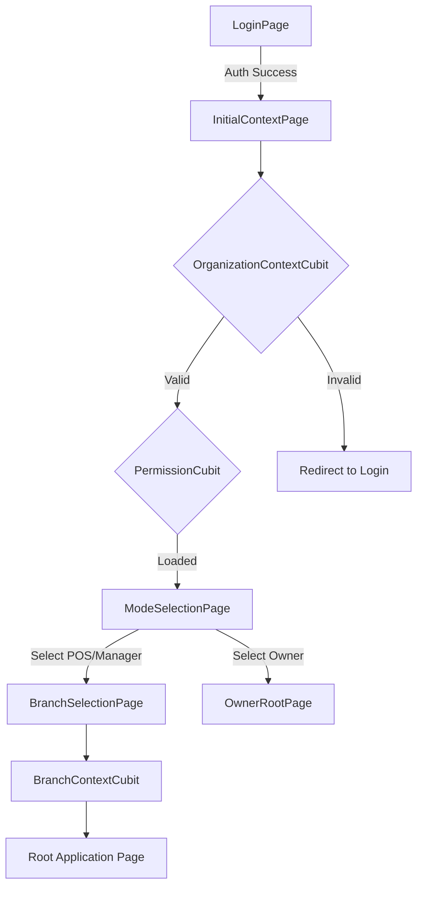

# Authentication & Enterprise Context Flow

This document details the sequential initialization flow required to ensure strict multi-tenant data isolation and context-aware operation.

## Sequence Overview

The application enforces a linear gate system after a user successfully authenticates. No user can access operational modes without passing all context validation gates.

## Gate Descriptions

### 1. Organization Context Gate
- **Purpose**: Validates that the authenticated user belongs to a valid organization.
- **Logic**: 
    - Queries `profiles` table using user UUID.
    - Fetches `organization_id`.
    - Validates organization existence in `organizations` table.
- **Result**: Emits `OrganizationContextLoaded` with global organization data.

### 2. Permission Gate
- **Purpose**: Loads all granular permission codes associated with the user's role.
- **Logic**: 
    - Queries `role_permissions` joined with `permissions`.
    - Aggregates codes into a `Set<String>` for efficient lookups.
- **Result**: Emits `PermissionLoaded`.

### 3. Application Mode Selection
- **Purpose**: Provides entry points based on role and permissions.
- **Modes**:
    - **Owner (Enterprise)**: Global view, bypasses branch selection.
    - **Manager Cabang**: Branch management (Inventory, Finance, etc.).
    - **Kasir (POS)**: Sales and operational.

### 4. Branch Selection (Conditional)
- **Purpose**: Sets the specific branch context for non-owner modes.
- **Logic**: Fetches `user_branch_memberships` for the specific organization.
- **Result**: Emits `BranchContextLoaded` with `branch_id`.
